# Building my DevOps Portfolio 🚀

## Project 7: Continuous Delivery using Jenkins & tools.
One of the benefits of working at EY is Udemy for Business. I enrolled in the DevOps Projects | 20 Real-Time DevOps Projects course to enhance my DevOps portfolio and I’m sharing this process for educational purposes.

### Scenario
- ✅ Agile Software Development Life Cycle.
- ✅ Developers make regular code changes.
- ✅ These commits need to be Build & Tested.
- ✅ Usually Build & Release Team will do this job or developers with responsibility to merge and integrate code

### Problem
❌ In Agile SDLC, there will be frequent code change.
❌ Not so frequently code will be tested.
❌ Developers need to rework to fix bugs and errors.
❌ Manual Build and release process.
❌ Inter team dependencies.

###  Solution: Continuous Delivery
- ♾️ Build and test for every commit.
- ♾️ Automated process.
- ♾️ Notify for every build status.
- ♾️ Fix code if bugs or error found instantly rather rather than waiting.

###  Benefits CI Pipeline 
- ✅ Short Mean time to recovery (MTTR).
- ✅ Agile.
- ✅ No human intervention.
- ✅ Fault isolation.

###  Tools
- 🛠️ Jenkins CI Server.
- 🛠️ Git.
- 🛠️ Maven.
- 🛠️ Checkstyle.
- 🛠️ Slack.
- 🛠️ Nexus Sonarqube.
- 🛠️ Docker
- 🛠️ AWS ECR
- 🛠️ AWS ECS
- 🛠️ AWS CLI

### Steps
- ⏭️Update github webhook.
- ⏭️Copy Docker Files from vprofile repo to my repo.
- ⏭️Prepare two separate Jenkinsfile for stagin and production
- ⏭️AWS Steps
-   ⏭️ IAM, ECR, repo setup
- ⏭️Jenkins steps
-   ⏭️Install plugins: Amazon ECR, Docker, Docker build & publish, Pipeline: AWS Steps
- ⏭️ Install docker engine and aws cli on jenkins server
- ⏭️Write Jenkinsfile for Build and publish image to ECR
- ⏭️ECS setup (Cluster, Task definition, Service)
- ⏭️Code for deploy docker image to ECS
- ⏭️ Repeat the steps for prod ECS Cluster
- ⏭️Promoting docker image for production.

## Continuous delivery steps images
- CD Pipeline Diagram
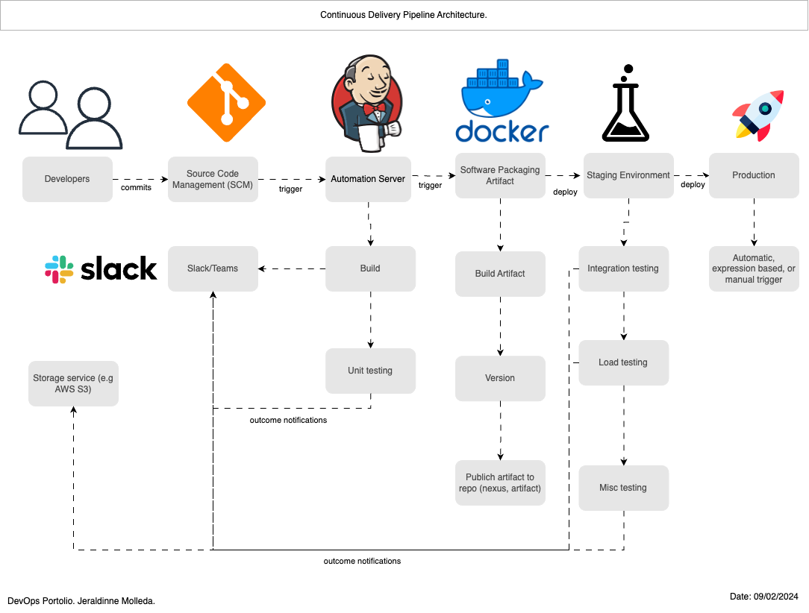
- CD Diagram
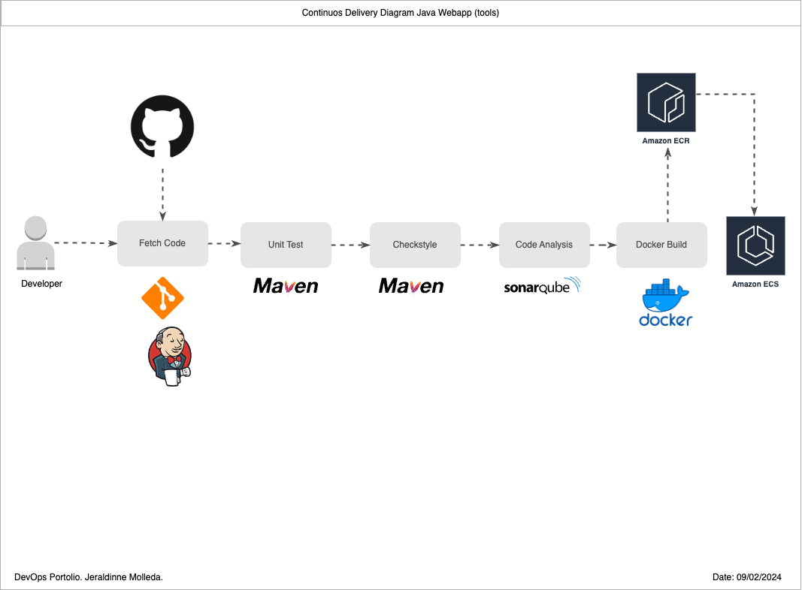
- EC2-servers on AWS
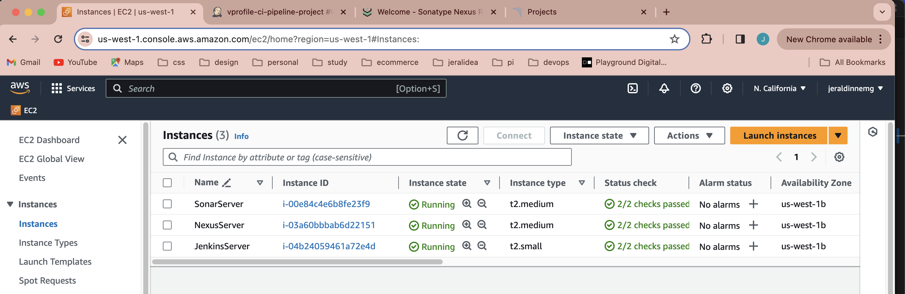
- AWS ECR
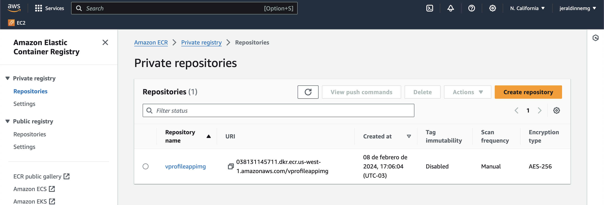
- AWS ECS
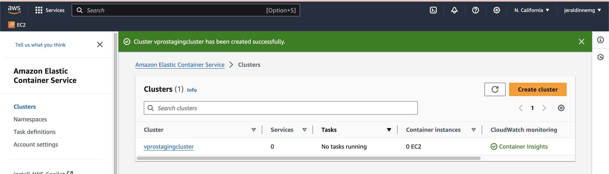
- AWS ECS Service
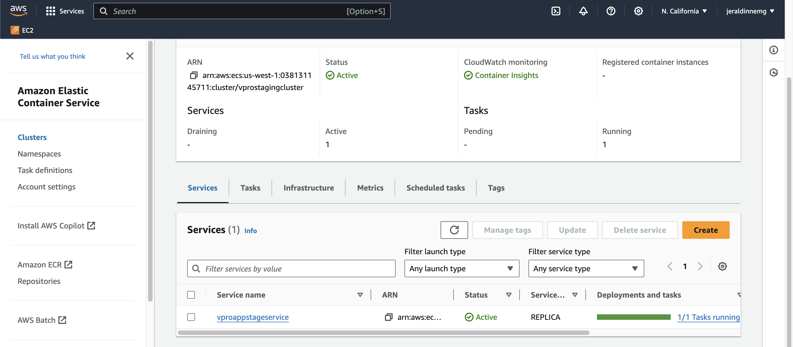
- AWS Security groups
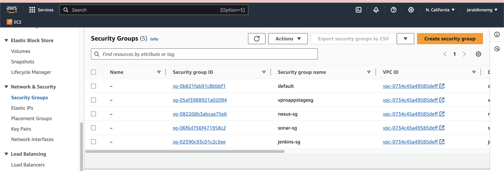
- CICD Pipeline
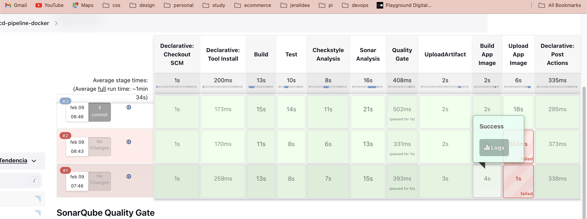
- CICD Pipeline (deploy to ECS stage)
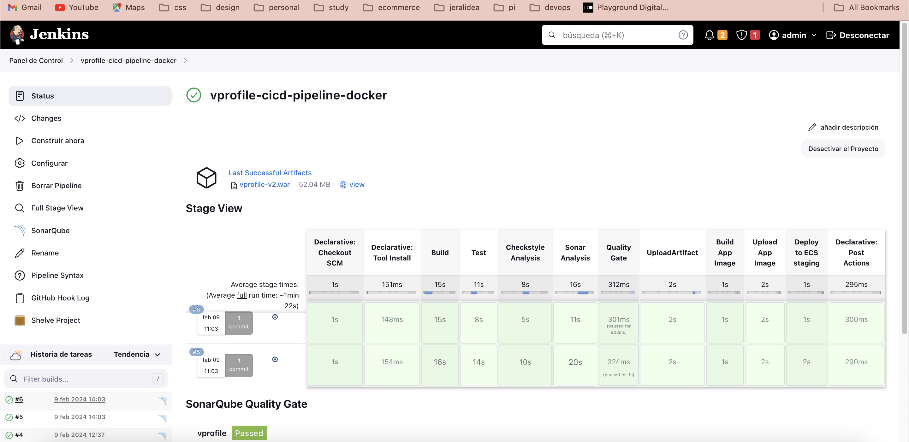
- Production pipeline
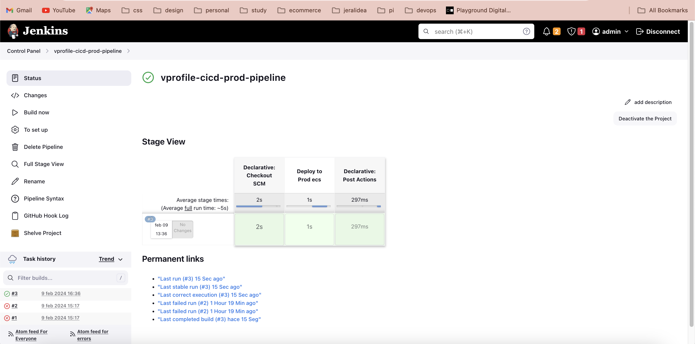
- Vprofile app hosted
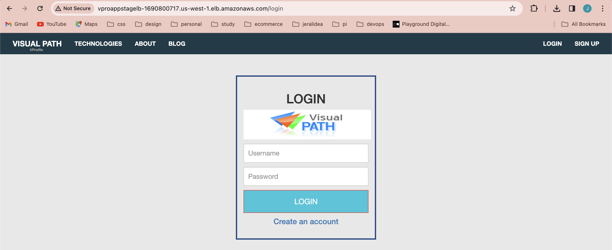
- Slack notification
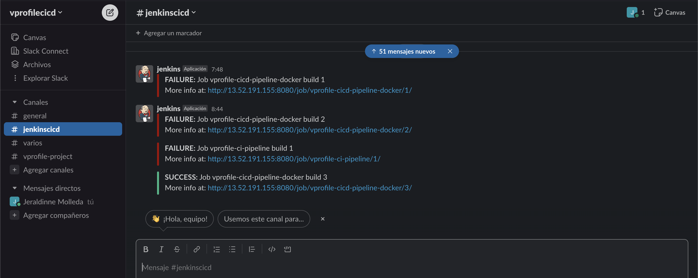

