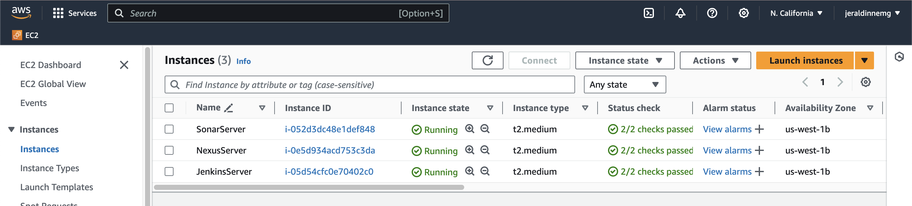

# Building my DevOps Portfolio 🚀

## Project 5: Continuous Integration using Jenkins pipeline

One of the benefits of working at EY is Udemy for Business. I enrolled in the DevOps Projects | 20 Real-Time DevOps Projects course to enhance my DevOps portfolio and I’m sharing this process for educational purposes.
Thanks Rox for giving me the free credits to keep using AWS to develop this project! Thanks for your support to the DevOps Community worldwide. 

### Scenario
- ✅ Agile Software Development Life Cycle.
- ✅ Developers make regular code changes.
- ✅ These commits need to be Build & Tested.
- ✅ Usually Build & Release Team will do this job or developers with responsibility to merge and integrate code

### Problem
❌ In Agile SDLC, there will be frequent code change.
❌ Not so frequently code will be tested.
❌ Developers need to rework to fix bugs and errors.
❌ Manual Build and release process.
❌ Inter team dependencies.

###  Solution: Continuous Integration
- ♾️ Build and test for every commit.
- ♾️ Automated process.
- ♾️ Notify for every build status.
- ♾️ Fix code if bugs or error found instantly rather rather than waiting.

###  Benefits CI Pipeline 
- ✅ Short Mean time to recovery (MTTR).
- ✅ Agile.
- ✅ No human intervention.
- ✅ Fault isolation.

###  Tools
- 🛠️ Jenkins CI Server.
- 🛠️ Git.
- 🛠️ Maven.
- 🛠️ Checkstyle.
- 🛠️ Slack.
- 🛠️ Nexus Sonarqube.
- 🛠️ AWS EC2.

### Steps
⏭️ Login to AWS Account.
⏭️ Create key pair.
⏭️ Create Security group (Jenkins, Nexus & Sonarqube).
⏭️ Create EC2 Instances with userdata (Jenkins, Nexus & Sonarqube).
⏭️ Post installation (a. Jenkins set up and plugins b. Nexus setup & repository setup c. Sonarqube login test).
⏭️ Create a github repo and migrate code.
⏭️ Build job with nexus integration.
⏭️ Github webhook.
⏭️ Sonarqube server integration stage.
⏭️ Nexus artifact upload stage.
⏭️ Integrate slack notification

## Continuous integration steps
- CI Diagram

- EC2-servers on AWS

- Jenkins Server

- Nexus server

- Sonarqube Scanner

- Slack notification

